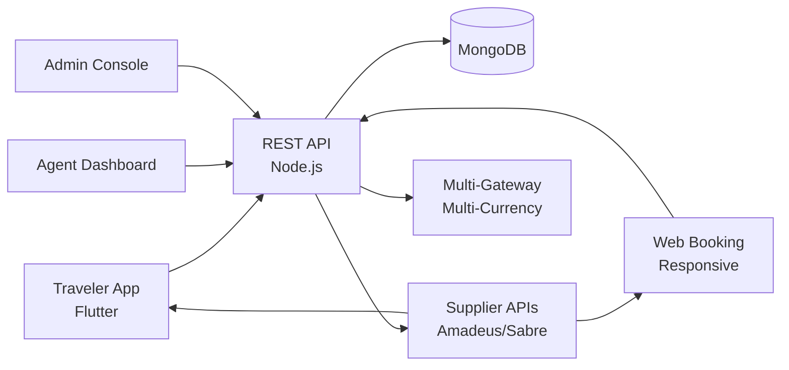

# Yatra Clone — White-Label Travel & Booking Marketplace Platform by Miracuves

**MXYatra** is a production-ready, white-label Yatra clone: a complete travel & booking marketplace with traveler, supplier, and admin panels — delivered with **100% source code ownership** in **6 working days**.

> ✈️ **See it running before you talk to anyone.** Live traveler app, agent dashboard, and admin console — demo credentials are printed on the [solution page](https://miracuves.com/yatra-clone#demo). No sales call required.

---

## 🚀 Live Demos

| Environment | URL | What you can test |
|---|---|---|
| 📱 Traveler App | [mas.mimeld.com](https://mas.mimeld.com) | Search, compare, book, manage itineraries |
| 🌐 Web Booking | [mxyatra.mimeld.com](https://mxyatra.mimeld.com) | Full travel experience in the browser |
| 🏨 Agent Dashboard | [Solution page → Demo](https://miracuves.com/yatra-clone#demo) | Inventory, bookings, pricing, customer support |
| 🛠️ Admin Console | [Solution page → Demo](https://miracuves.com/yatra-clone#demo) | Partners, categories, commissions, fraud, analytics |

Demo credentials for all environments: **[miracuves.com/yatra-clone → Demo section](https://miracuves.com/yatra-clone/#demo)**

---

## ✨ What Makes This Yatra Clone Different

Most travel scripts stop at "search + book a hotel." This platform ships with the features that actually run a travel *business*:

- **Multi-Modal Inventory** — hotels, flights, packages, cars, transfers, activities — all bookable from the same flow, with one unified cart and checkout
- **Supplier API Aggregator** — plug into booking engines (Amadeus, Sabre, HotelBeds, Expedia) for live inventory — not just a static catalog
- **Dynamic Pricing Engine** — rule-based + ML pricing per route, season, and remaining-inventory — same engines Booking and MakeMyTrip run
- **360° Trip Builder** — drag-and-drop day-by-day itinerary builder with maps, weather, and curated experiences — what OTAs are racing to copy
- **White-Label for Agencies** — sub-domain per travel agent with their branding, customers, and commission — white-label-of-white-label built in

## 📦 Core Features

**Traveler:** search & compare · filters by price · reviews · secure checkout · itinerary management · cancellation · multi-payment · loyalty rewards · multi-language

**Agent/Operator:** inventory management · booking management · pricing tools · customer messaging · reviews · analytics · payout requests

**Admin:** partner onboarding · category & city management · commission engine · dispute resolution · fraud detection · analytics reports

## 🏗️ Architecture

**Stack:** Flutter mobile apps (Android + iOS) · Node.js or Laravel backend · MongoDB for inventory · Elasticsearch for search · Redis for session and pricing cache · Stripe, Razorpay, PayPal, regional gateways; multi-currency support

## 📋 What’s Included

- ✅ Full source code — backend, web, mobile apps, panels (no encryption, no license locks)
- ✅ Deployment to your servers & app store submission assistance
- ✅ Your branding — white-label rename, logo, colors, domain
- ✅ 60 days post-launch support + 12 months of free updates
- ✅ Documentation & handover

**Pricing:** from **$2,899**, transparent on the [solution page](https://miracuves.com/yatra-clone/#pricing) — no "contact us for quote" games.

## 🆚 Why Not Build From Scratch?

Custom travel platforms run $80k–$500k and 6–12 months. A proven white-label base gets you to market in 6 working days for a fraction of that, with your budget preserved for supplier contracts and marketing.

## 📚 Resources

- 📖 [Yatra Clone — Full Solution Page](https://miracuves.com/yatra-clone) (features, pricing, demos, FAQ)
- 💰 [How Much Does a Travel App Cost in 2026?](https://miracuves.com/yatra-clone#pricing) pricing breakdown & what's included
- 📝 [Best Yatra Clone Script in 2026](https://miracuves.com/yatra-clone/blog/) features, pricing & launch guide
- 🧠 [Multi-Modal Booking Is the New Travel Stack](https://miracuves.com/yatra-clone/blog/) hotels + flights + experiences in one cart
- ✅ [Miracuves Facts & Claims Ledger](https://miracuves.com/yatra-clone/facts/) every claim we make, verified

## 🏢 About Miracuves

[Miracuves Solutions](https://miracuves.com) builds white-label clone apps and custom software from Mumbai, India — 90+ ready-made solutions, live demos for every product, transparent pricing, and delivery in 6 working days. Operating since 2010.

**Talk to us:** [WhatsApp](https://wa.me/919830009649) · [Schedule a consultation](https://miracuves.com/schedule-consultation/) · [miracuves.com](https://miracuves.com)

---

### ⚠️ Note on This Repository

This repository is a product overview. The full source code is delivered to clients on purchase — see [what’s included](https://miracuves.com/yatra-clone/#included). For a hands-on evaluation, use the live demos above; credentials are public on the solution page.

*Keywords: yatra clone, yatra clone script, travel booking, OTA platform, hotel booking, flight booking, white label travel, Flutter travel app, Node.js travel platform*

---

<!--
══════════════════════════════════════════════════
TEMPLATE VARIABLE KEY — auto-generated from Netflix-Clone pattern
══════════════════════════════════════════════════
{APP_NAME}        Yatra Clone
{MX_NAME}         MXYatra
{CATEGORY}        Travel & Booking Marketplace Platform
{DEMO_WEB}        mxyatra.mimeld.com
{PRICE}           $2,899
{SLUG}            yatra-clone
{SOLUTION_URL}    https://miracuves.com/yatra-clone/
{VERTICAL}        travel_booking

See /tmp/verticals/travel_booking.txt for the vertical config used to generate this README.
══════════════════════════════════════════════════
-->